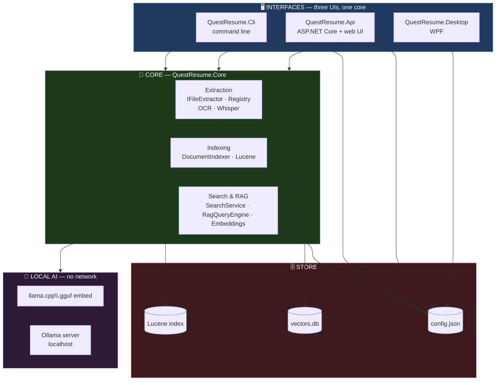
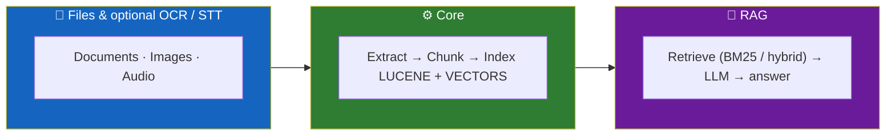
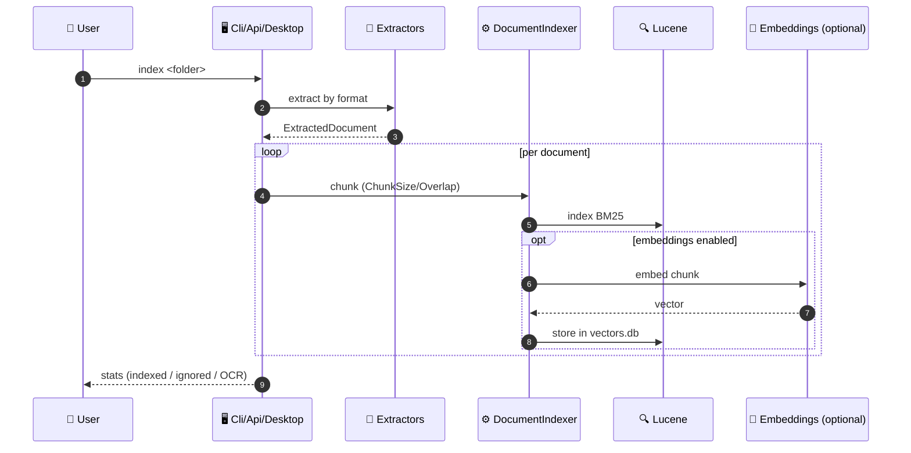
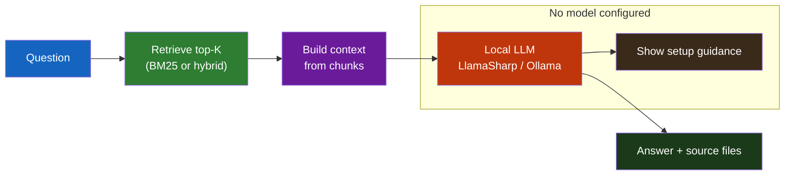

<div align="center">

**🌐 Choose Language / Selecione o Idioma / Elija el Idioma**

[](README.md)&nbsp;&nbsp;&nbsp;[](README_PT.md)&nbsp;&nbsp;&nbsp;[](README_ES.md)

</div>

---

<div align="center">

```
 ██████╗ ██╗   ██╗███████╗███████╗████████╗██████╗ ███████╗███████╗██╗   ██╗███╗   ███╗███████╗
██╔═══██╗██║   ██║██╔════╝██╔════╝╚══██╔══╝██╔══██╗██╔════╝██╔════╝██║   ██║████╗ ████║██╔════╝
██║   ██║██║   ██║█████╗  ███████╗   ██║   ██████╔╝█████╗  ███████╗██║   ██║██╔████╔██║█████╗
██║▄▄ ██║██║   ██║██╔══╝  ╚════██║   ██║   ██╔══██╗██╔══╝  ╚════██║██║   ██║██║╚██╔╝██║██╔══╝
╚██████╔╝╚██████╔╝███████╗███████║   ██║   ██║  ██║███████╗███████║╚██████╔╝██║ ╚═╝ ██║███████╗
 ╚══▀▀═╝  ╚═════╝ ╚══════╝╚══════╝   ╚═╝   ╚═╝  ╚═╝╚══════╝╚══════╝  ╚═════╝ ╚═╝     ╚═╝╚══════╝
          100% Offline Local RAG — index your files, ask in natural language
```

---

[](https://dotnet.microsoft.com/)
[](https://lucenenet.apache.org/)
[](https://github.com/SciSharp/LLamaSharp)
[](https://learn.microsoft.com/dotnet/desktop/wpf/)
[](https://dotnet.microsoft.com/apps/aspnet)

<br/>

> **A 100% offline system to index your local files and answer natural-language questions**
> **about them, using Lucene.NET full-text search, optionally hybrid vector search,**
> **and a local AI model (embedded LLamaSharp/llama.cpp or Ollama). No runtime network calls.**

<br/>


</div>

---

## 📑 Table of Contents

<details>
<summary>▶️ <strong>Click to expand / collapse this section</strong></summary>

<table>
<tr>
<td valign="top" width="50%">

**🏗️ System**
- [Overview](#-overview)
- [System Architecture](#-system-architecture)
- [Technology Stack](#-technology-stack)
- [Design Patterns](#-design-patterns-applied)
- [Project Structure](#-project-structure)

**📦 Modules**
- [Core Extraction & Indexing](#-core-extraction--indexing)
- [Core Search & RAG](#-core-search--rag)
- [Cli](#-cli)
- [Api](#-api)
- [Desktop](#-desktop)

</td>
<td valign="top" width="50%">

**💼 Business**
- [Business Rules](#-business-rules)
- [Functional Requirements](#-functional-requirements)
- [Non-Functional Requirements](#-non-functional-requirements)

**📐 Design**
- [Data Model](#-data-model)
- [System Flows](#-system-flows)
- [Indexing Flow](#indexing-flow)
- [RAG Question Flow](#rag-question-flow)

**🔐 Security & Ops**
- [Security](#-security)
- [Installation & Execution](#-installation--execution)
- [Automated Tests](#-automated-tests)
- [Metrics & Monitoring](#-metrics--monitoring)
- [Known Limitations](#-known-limitations)

</td>
</tr>
</table>

---

</details>

## 🌟 Overview

<details>
<summary>▶️ <strong>Click to expand / collapse this section</strong></summary>

**QuestResume** is a **100% offline** system for indexing the content of local files and answering natural-language questions about them, using full-text search (Lucene.NET), optionally combined with vector search (embeddings), and a local AI model to generate answers (embedded LLamaSharp/llama.cpp, or Ollama as an alternative).

No network call is made at runtime (even with Ollama, which runs locally), there is no per-token/request cost, and your files never leave the machine.

Optional features (all disabled by default, with graceful degradation — the system works normally without them):

- **OCR** (Tesseract 5): extracts text from images and scanned PDFs (without selectable text).
- **Audio transcription** (Whisper.net): extracts text from `.wav` files (16 kHz mono).
- **Embeddings + hybrid search**: combines keyword search (BM25) with semantic similarity search (vectors), improving context retrieval for RAG.
- **Ollama**: uses a local [Ollama](https://ollama.com) server as an alternative to the embedded `.gguf` model.

### 🎯 System Objectives

| Objective | Description |
|-----------|-------------|
| 🔒 **Privacy by design** | Files never leave the machine; no network calls at runtime |
| 💸 **No per-token cost** | Runs entirely on free local models; nothing billed per request |
| 🔍 **Full-text search** | Lucene.NET BM25 keyword search over indexed documents |
| 🧠 **Semantic search (optional)** | ONNX embeddings + hybrid BM25/vector retrieval for better context |
| 💬 **Local LLM answers** | Embedded `llama.cpp` (.gguf) or a local Ollama server for RAG answers |
| 📄 **Broad format support** | 26+ text formats natively, plus optional OCR images and audio transcription |

---

</details>

## 🏗️ System Architecture

<details>
<summary>▶️ <strong>Click to expand / collapse this section</strong></summary>

### Module Diagram



### Layered Flow



---

</details>

## 🛠️ Technology Stack

<details>
<summary>▶️ <strong>Click to expand / collapse this section</strong></summary>

<table>
<thead>
<tr>
<th>Layer</th>
<th>Technology</th>
<th>Version</th>
<th>Purpose</th>
</tr>
</thead>
<tbody>
<tr>
<td><strong>🧠 Runtime</strong></td>
<td>.NET</td>
<td>8</td>
<td>Target framework; Desktop requires Windows (WPF)</td>
</tr>
<tr>
<td><strong>🔍 Full-text search</strong></td>
<td>Lucene.NET</td>
<td>—</td>
<td>BM25 keyword indexing and retrieval</td>
</tr>
<tr>
<td><strong>🧠 Local LLM</strong></td>
<td>LLamaSharp (llama.cpp)</td>
<td>—</td>
<td>Embedded `.gguf` model generation for RAG</td>
</tr>
<tr>
<td><strong>🦙 LLM alternative</strong></td>
<td>Ollama</td>
<td>—</td>
<td>Local server as an alternative provider</td>
</tr>
<tr>
<td><strong>👁️ OCR</strong></td>
<td>Tesseract 5</td>
<td>5</td>
<td>Text from images and scanned PDFs (optional)</td>
</tr>
<tr>
<td><strong>🎙️ Transcription</strong></td>
<td>Whisper.net</td>
<td>—</td>
<td>Transcribe `.wav` audio (optional, ffmpeg for resample)</td>
</tr>
<tr>
<td><strong>🧲 Embeddings</strong></td>
<td>ONNX Runtime + BERT tokenizer</td>
<td>—</td>
<td>Semantic vectors for hybrid search (optional)</td>
</tr>
<tr>
<td><strong>🖥️ Desktop</strong></td>
<td>WPF</td>
<td>net8.0-windows</td>
<td>Desktop app</td>
</tr>
<tr>
<td><strong>⚙️ API</strong></td>
<td>ASP.NET Core</td>
<td>8</td>
<td>Local API + static web UI</td>
</tr>
<tr>
<td><strong>🧪 Testing</strong></td>
<td>xUnit + optional integration</td>
<td>—</td>
<td>Core unit tests plus env-gated integration tests</td>
</tr>
</tbody>
</table>

---

</details>

## 📐 Design Patterns Applied

<details>
<summary>▶️ <strong>Click to expand / collapse this section</strong></summary>

| Pattern | Where | Rationale |
|---------|-------|-----------|
| 🔌 **Strategy per extractor** | `IFileExtractor` + `ExtractorRegistry` | New formats plug in without touching indexing, search, or RAG |
| 🏭 **Registry / factory** | `ExtractorRegistry.DefaultExtractors()` | Central registration of all supported formats |
| 🧩 **Plugin loading** | `IExtractorPlugin` + `PluginLoader` | Loads extractor plugins dynamically |
| 🛡️ **Graceful degradation** | OCR/STT/embeddings disabled by default | Missing optional resources degrade cleanly, never crash |
| 📐 **Config-driven behavior** | Single `config.json` shared by all UIs | `TopK`, `ChunkSize`, providers, weights configurable without code changes |
| 🎯 **RAG retrieval–generation separation** | `SearchService`/`RagQueryEngine` | Retrieval (BM25/hybrid) is decoupled from LLM generation |
| 📦 **Shared core across UIs** | `QuestResume.Core` referenced by Cli/Api/Desktop | One extraction/index/search pipeline reused by all interfaces |
| 🌊 **Chunked indexing** | `ChunkSize` + `ChunkOverlap` | Documents split into overlapping chunks for granular retrieval |

---

</details>

## 📁 Project Structure

<details>
<summary>▶️ <strong>Click to expand / collapse this section</strong></summary>

```
QuestResume/
│
├── 📄 QuestResume.slnx             # Solution file
├── 📄 Dockerfile                    # API container packaging
├── 📄 README.md                     # 🇺🇸 English (primary)
├── 📄 README_PT.md                  # 🇧🇷 Português
├── 📄 README_ES.md                  # 🇪🇸 Español
│
├── 📂 src/
│   ├── 📂 QuestResume.Core/         # Shared library: extraction, indexing, search, RAG
│   │   ├── Extraction/             # IFileExtractor · ExtractorRegistry · PluginLoader
│   │   │   └── EncodingDetector · LanguageDetector
│   │   ├── Indexing/              # DocumentIndexer
│   │   ├── Search/                # SearchService · RagQueryEngine
│   │   └── Embeddings/            # EmbeddingService (ONNX + BERT tokenizer)
│   ├── 📂 QuestResume.Cli/          # Command-line interface
│   ├── 📂 QuestResume.Api/          # Local ASP.NET Core API + static web UI
│   ├── 📂 QuestResume.Desktop/      # WPF desktop app
│   └── 📂 QuestResume.Mobile/        # Mobile companion app
│
├── 📂 tests/
│   ├── 📂 QuestResume.Core.Tests/             # Unit + optional integration tests
│   └── 📂 QuestResume.Api.IntegrationTests/   # API integration tests
│
└── 📂 models/
    └── 📂 llm/                      # (.gitignored) downloadable .gguf models
```

---

</details>

## 📦 System Modules

<details>
<summary>▶️ <strong>Click to expand / collapse this section</strong></summary>

### 🧬 Core — Extraction & Indexing

`QuestResume.Core/Extraction` defines `IFileExtractor` plus an `ExtractorRegistry` of 26+ direct text formats: documents (PDF incl. PDF/A, DOCX, ODT, RTF), spreadsheets/presentations (XLSX, PPTX), text/data (TXT, CSV, JSON, XML, HTML/HTM, CSS, JS, BIB, TEX, ICS, VCF), notebooks (IPYNB), e-books (EPUB), and e-mails (EML, MSG). Unsupported extensions (video, executables) are counted as "ignored" rather than crashing indexing.

With optional features enabled: images (`.png`, `.jpg`, `.jpeg`, `.tiff`, `.bmp`, `.gif`) via Tesseract OCR; scanned PDFs (pages without extractable text are rasterized and OCR'd automatically); audio (`.wav`, 16 kHz mono) via Whisper.net transcription.

### 🔍 Core — Search & RAG

`SearchService` performs BM25 keyword retrieval (or hybrid BM25 + vector via `EmbeddingService`); `RagQueryEngine` retrieves the top-K chunks and sends them to the local LLM (LLamaSharp `.gguf` or Ollama) to compose a natural-language answer with source files shown.

### 💻 Cli

`QuestResume.Cli` is the command-line interface: `index`, `search`, `ask`, `chat`, and `config` commands (set-model, set-folder, providers, OCR, embeddings, STT).

### 🌐 Api

`QuestResume.Api` is a local ASP.NET Core server with a static web UI and REST endpoints (`/api/status`, `/api/config`, `/api/index`, `/api/search`, `/api/ask`).

### 🖥️ Desktop

`QuestResume.Desktop` is a WPF app with a **Questions** tab (choose folder, index, chat showing source files) and a **Settings** tab for model, index path, Top-K, context size, and optional feature config.

---

</details>

## 📋 Business Rules

<details>
<summary>▶️ <strong>Click to expand / collapse this section</strong></summary>

| # | Rule | Enforcement |
|---|------|-------------|
| BR-01 | No network calls are made at runtime; files never leave the machine | Local-only LLM/embedding providers |
| BR-02 | Optional features are disabled by default and degrade gracefully | `OcrEnabled`/`SttEnabled`/`EmbeddingsEnabled` default `false`; missing resources show guidance, not errors |
| BR-03 | Unsupported file extensions are counted as "ignored", not failures | Indexer statistics track ignored files |
| BR-04 | OCR requires a configured `TessDataPath` and enabled flag | Without it, images/scan PDFs are skipped |
| BR-05 | Whisper expects PCM 16 kHz mono; other rates are auto-converted via ffmpeg or skipped with guidance | Audio extractor logic |
| BR-06 | Hybrid search weights BM25 vs vectors via `HybridBm25Weight` | 0 = pure vector, 1 = pure BM25, 0.5 default |
| BR-07 | All three UIs share the same config file and index | Single `%LOCALAPPDATA%\QuestResume` location |
| BR-08 | Asking with no valid `.gguf`/Ollama shows setup guidance, never a generic error | RAG engine graceful messaging |

---

</details>

## ✨ Functional Requirements

<details>
<summary>▶️ <strong>Click to expand / collapse this section</strong></summary>

| ID | Requirement | Priority | Status |
|----|-------------|----------|--------|
| **RF-01** | Index a folder of documents with 26+ text formats | 🔴 High | ✅ Implemented |
| **RF-02** | Keyword search using Lucene.NET BM25 (no model needed) | 🔴 High | ✅ Implemented |
| **RF-03** | Natural-language questions with RAG using a local LLM | 🔴 High | ✅ Implemented |
| **RF-04** | Interactive chat mode (`chat`) | 🟡 Medium | ✅ Implemented |
| **RF-05** | Optional OCR for images and scanned PDFs | 🟡 Medium | ✅ Implemented |
| **RF-06** | Optional Whisper transcription for `.wav` audio | 🟡 Medium | ✅ Implemented |
| **RF-07** | Optional embeddings + hybrid BM25/vector search | 🟡 Medium | ✅ Implemented |
| **RF-08** | Optional Ollama as LLM provider | 🟡 Medium | ✅ Implemented |
| **RF-09** | Web UI via local API | 🟢 Low | ✅ Implemented |
| **RF-10** | WPF desktop app with config UI | 🟢 Low | ✅ Implemented |
| **RF-11** | Graceful degradation of all optional features | 🔴 High | ✅ Implemented |
| **RF-12** | Show source files for each answer | 🟢 Low | ✅ Implemented |
| **RF-13** | Docker packaging for the API | 🟢 Low | ✅ Implemented |
| **RF-14** | Config `set`/`show` commands across all settings | 🟡 Medium | ✅ Implemented |

---

</details>

## ⚙️ Non-Functional Requirements

<details>
<summary>▶️ <strong>Click to expand / collapse this section</strong></summary>

| ID | Category | Requirement | Target |
|----|----------|-------------|--------|
| **RNF-01** | 🔐 Privacy | Zero network calls at runtime | Local-only LLM/embeddings/OCR/STT |
| **RNF-02** | 💸 Cost | No per-token/per-request cost | Free local models |
| **RNF-03** | 🛡️ Resilience | Missing optional resources never crash | Graceful degradation paths |
| **RNF-04** | 🧩 Extensibility | New formats added without core changes | `IFileExtractor` + registry |
| **RNF-05** | 📦 Compatibility | Runs on machines with 8 GB RAM | Q4_K_M models ~2 GB |
| **RNF-06** | 🔀 Portability | CLI/API on any .NET 8 OS; Desktop Windows-only | `net8.0-windows` WPF |
| **RNF-07** | 🔍 Retrieval quality | Context recall for paraphrased queries | Hybrid BM25 + vector retrieval |
| **RNF-08** | 🧪 Testability | Optional features testable without real models | Env-gated integration tests |
| **RNF-09** | 🗄️ State sharing | One index/config usable from any UI | Shared `%LOCALAPPDATA%` location |

---

</details>

## 🗄️ Data Model

<details>
<summary>▶️ <strong>Click to expand / collapse this section</strong></summary>

### Configuration (`config.json`)

| Field | Description | Default |
|-------|-------------|---------|
| `DocumentsFolder` | Last indexed folder | (empty) |
| `IndexPath` | Lucene index + vector store folder | `%LOCALAPPDATA%\QuestResume\index` |
| `ModelPath` | `.gguf` model path (when `LlmProvider=LlamaSharp`) | (empty) |
| `TopK` | Chunks retrieved per question | 5 |
| `ChunkSize` | Chunk length in characters | 1000 |
| `ChunkOverlap` | Overlap between chunks | 150 |
| `ContextSize` | LLM context size (tokens) | 4096 |
| `LlmProvider` | Generation provider: `LlamaSharp` or `Ollama` | `LlamaSharp` |
| `OllamaBaseUrl` | Local Ollama server URL | `http://localhost:11434` |
| `OllamaModel` | Ollama model name | `llama3.2` |
| `OcrEnabled` / `TessDataPath` / `OcrLanguages` | OCR toggle, tessdata path, languages | `false` / (empty) / `por+eng` |
| `EmbeddingsEnabled` / `EmbeddingModelPath` / `EmbeddingTokenizerPath` / `HybridBm25Weight` | Hybrid search toggle, ONNX model, tokenizer, BM25 weight | `false` / (empty) / (empty) / `0.5` |
| `SttEnabled` / `WhisperModelPath` | Audio transcription toggle, ggml model | `false` / (empty) |

### Stores

| Store | Purpose |
|-------|---------|
| Lucene index | BM25 full-text index at `IndexPath` |
| `vectors.db` | Semantic embeddings per chunk (when enabled) |
| `config.json` | Shared configuration read/written by all UIs |
| SQLite-backed metadata | Extracted document metadata |

---

</details>

## 🔄 System Flows

<details>
<summary>▶️ <strong>Click to expand / collapse this section</strong></summary>

### Indexing Flow



### RAG Question Flow



---

</details>

## 🔐 Security

<details>
<summary>▶️ <strong>Click to expand / collapse this section</strong></summary>

### Implemented Controls

| Control | Implementation |
|---------|---------------|
| 🔒 **Local-only processing** | No runtime network calls; files never leave the machine |
| 🔑 **Local model privacy** | LLM and embeddings run fully on-device |
| 🧾 **Graceful failure** | Missing optional features show guidance rather than expose errors |
| 🗄️ **Local storage** | Index, vectors, and config live under `%LOCALAPPDATA%` |

### Known Security Limitations

| Limitation | Risk | Mitigation path |
|------------|------|-----------------|
| 🔓 **No encryption at rest** | Index/config are stored in plaintext on disk | Add OS-protected encryption for sensitive corpora |
| 🌐 **Ollama localhost exposure** | Ollama server may be reachable on the local network | Bind Ollama to `localhost` only |
| 🧰 **ffmpeg dependency** | Audio conversion delegates to an external binary on PATH | Document/system-installed ffmpeg |

---

</details>

## 🚀 Installation & Execution

<details>
<summary>▶️ <strong>Click to expand / collapse this section</strong></summary>

### Prerequisites

- [.NET 8 SDK](https://dotnet.microsoft.com/download/dotnet/8.0)
- Windows (the Desktop app uses WPF; CLI and API run on any .NET 8 OS)
- Optional but required for AI questions: a `.gguf` language model

### Build

```powershell
dotnet build QuestResume.sln
```

### CLI

```powershell
# Index a folder of documents
dotnet run --project src/QuestResume.Cli -- index "C:\Users\you\Documents"

# Keyword search (no AI model needed)
dotnet run --project src/QuestResume.Cli -- search "rental agreement"

# Ask in natural language (needs a configured .gguf model)
dotnet run --project src/QuestResume.Cli -- ask "What is the rent amount mentioned in the documents?"

# Interactive chat
dotnet run --project src/QuestResume.Cli -- chat

# Configuration
dotnet run --project src/QuestResume.Cli -- config show
dotnet run --project src/QuestResume.Cli -- config set-model "C:\Models\Phi-3-mini-4k-instruct-q4.gguf"
```

### API + Web

```powershell
dotnet run --project src/QuestResume.Api
```

Open the printed address (e.g. `http://localhost:5000`) in a browser: index a folder, search, ask, and configure the AI model, OCR, STT, and embeddings/hybrid search in the Settings tab.

### Desktop

```powershell
dotnet run --project src/QuestResume.Desktop
```

### Publishing

```powershell
# Self-contained Windows desktop exe
dotnet publish src/QuestResume.Desktop -c Release -p:PublishProfile=win-x64

# API container
docker build -t questresume-api .
docker run -p 8080:8080 -v questresume-data:/root/.local/share/QuestResume questresume-api
```

---

</details>

## 🧪 Automated Tests

<details>
<summary>▶️ <strong>Click to expand / collapse this section</strong></summary>

### Unit Tests

Covers the "feature not configured" path (graceful degradation) for OCR, transcription, and embeddings without needing real models, plus core indexing/search logic.

```powershell
dotnet test tests/QuestResume.Core.Tests
```

### Optional Integration Tests

Only run when environment variables point to existing files/folders (otherwise they pass doing nothing):

| Variable | Tests |
|----------|-------|
| `QUESTRESUME_TEST_TESSDATA_PATH` (+ `QUESTRESUME_TEST_OCR_LANGUAGES`) | OCR with a generated image |
| `QUESTRESUME_TEST_WHISPER_MODEL` | Transcription with a test `.wav` |
| `QUESTRESUME_TEST_EMBEDDING_MODEL` + `QUESTRESUME_TEST_EMBEDDING_TOKENIZER` | Semantic embeddings |

### CI

`.github/workflows/ci.yml` builds the full solution and runs tests on `windows-latest` (required because Desktop uses WPF/`net8.0-windows`) on every push/PR to `main`.

---

</details>

## 📊 Metrics & Monitoring

<details>
<summary>▶️ <strong>Click to expand / collapse this section</strong></summary>

### Codebase Metrics

| Metric | Value |
|--------|-------|
| Solution projects | 7 (Core, Cli, Api, Desktop, Mobile + 2 test projects) |
| C# files (src) | 310 |
| C# files (tests) | 97 |
| Direct text formats | 26+ |
| Optional engines | 3 (OCR, STT, embeddings) |
| UIs sharing one core | 3 (CLI, API+Web, Desktop) |

### Runtime Signals

| Signal | Source | Where to observe |
|--------|--------|--------------------|
| Index status | `/api/status` | API / CLI `config show` |
| Optional feature state | OCR/embeddings/STT flags | `/api/status` |
| Indexed / ignored counts | Indexer statistics | After each `index` run |
| Provider health | LlamaSharp vs Ollama | Question flow messages |

### API Endpoints

| Method | Route | Description |
|--------|-------|-------------|
| `GET` | `/api/status` | Index, provider, and optional feature status |
| `GET`/`PUT` | `/api/config` | Read / update configuration |
| `POST` | `/api/index` | Index a folder |
| `POST` | `/api/search` | BM25 or hybrid search |
| `POST` | `/api/ask` | RAG question |

---

</details>

## ⚠️ Known Limitations

<details>
<summary>▶️ <strong>Click to expand / collapse this section</strong></summary>

| Category | Issue | Status |
|----------|-------|--------|
| 🖼️ **OCR languages** | Requires downloaded Tesseract `tessdata` files (`por+eng` default) | ➕ Intentional — optional dependency |
| 🎙️ **Audio format** | Whisper.net does not resample; `.wav` must be PCM 16 kHz mono, or converted via ffmpeg | ⚠️ Open — document/install ffmpeg |
| 🧲 **Embedding model constraint** | Requires a WordPiece/BERT tokenizer (`vocab.txt`); XLM-RoBERTa/SentencePiece models are incompatible | ➕ Intentional — documented |
| 🧠 **LLM size on low-RAM machines** | Larger models (Mistral-7B ~4.4 GB) need 16 GB+ RAM | ➕ Recommend Q4_K_M smaller models |
| 🔓 **No encryption at rest** | Index and config stored plaintext | ⬜ Planned — OS-protected encryption |
| 🌐 **Ollama exposure** | Ollama may be reachable on the local network if bound broadly | ⬜ Planned — bind to localhost |

> [!TIP]
> Next step: a metadata extractor (`MetadataExtractor`/ExifTool) filling only `ExtractedDocument.Metadata` (author, dates, dimensions, codec) with empty `Text` — valuable for metadata search. Add a new format by implementing `IFileExtractor` and registering it in `ExtractorRegistry.DefaultExtractors()`; `DocumentIndexer`, `SearchService`, and `RagQueryEngine` need no changes.

</details>

---

<div align="center">

---

### 🔍 QuestResume

*100% offline RAG — your files never leave the machine.*

[](https://dotnet.microsoft.com/)
[]()
[]()
[]()

<br/>

```
"Index what you have. Ask in plain language. Nothing leaves your machine."
```

</div>
