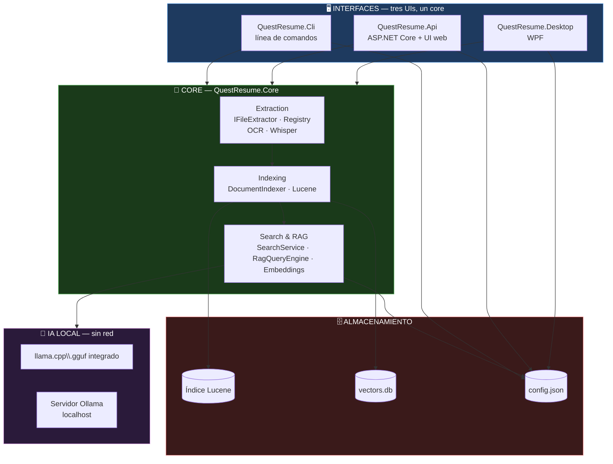
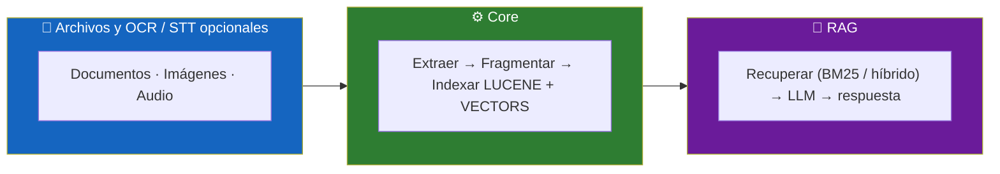
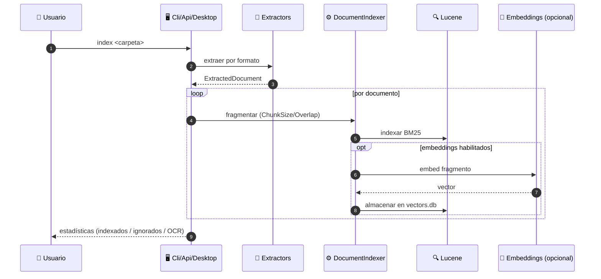
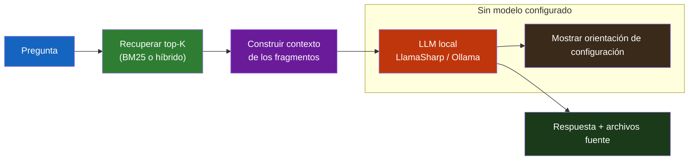

<div align="center">

**🌐 Choose Language / Selecione o Idioma / Elija el Idioma**

[](README.md)&nbsp;&nbsp;&nbsp;[](README_PT.md)&nbsp;&nbsp;&nbsp;[](README_ES.md)

</div>

---

<div align="center">

```
 ██████╗ ██╗   ██╗███████╗███████╗████████╗██████╗ ███████╗███████╗██╗   ██╗███╗   ███╗███████╗
██╔═══██╗██║   ██║██╔════╝██╔════╝╚══██╔══╝██╔══██╗██╔════╝██╔════╝██║   ██║████╗ ████║██╔════╝
██║   ██║██║   ██║█████╗  ███████╗   ██║   ██████╔╝█████╗  ███████╗██║   ██║██╔████╔██║█████╗
██║▄▄ ██║██║   ██║██╔══╝  ╚════██║   ██║   ██╔══██╗██╔══╝  ╚════██║██║   ██║██║╚██╔╝██║██╔══╝
╚██████╔╝╚██████╔╝███████╗███████║   ██║   ██║  ██║███████╗███████║╚██████╔╝██║ ╚═╝ ██║███████╗
 ╚══▀▀═╝  ╚═════╝ ╚══════╝╚══════╝   ╚═╝   ╚═╝  ╚═╝╚══════╝╚══════╝  ╚═════╝ ╚═╝     ╚═╝╚══════╝
         RAG Local 100 % sin conexión — indexa tus archivos, pregunta en lenguaje natural
```

---

[](https://dotnet.microsoft.com/)
[](https://lucenenet.apache.org/)
[](https://github.com/SciSharp/LLamaSharp)
[](https://learn.microsoft.com/dotnet/desktop/wpf/)
[](https://dotnet.microsoft.com/apps/aspnet)

<br/>

> **Un sistema 100 % sin conexión para indexar tus archivos locales y responder preguntas**
> **en lenguaje natural sobre ellos, usando búsqueda de texto completo (Lucene.NET),**
> **opcionalmente búsqueda vectorial híbrida, y un modelo de IA local (LLamaSharp/llama.cpp**
> **integrado u Ollama). Sin llamadas de red en tiempo de ejecución.**

<br/>

-310-512BD4?style=flat-square)


</div>

---

## 📑 Tabla de Contenidos

<details>
<summary>▶️ <strong>Haz clic para expandir / contraer esta sección</strong></summary>

<table>
<tr>
<td valign="top" width="50%">

**🏗️ Sistema**
- [Visión General](#-visi%C3%B3n-general)
- [Arquitectura del Sistema](#-arquitectura-del-sistema)
- [Stack Tecnológico](#-stack-tecnol%C3%B3gico)
- [Patrones de Diseño](#-patrones-de-dise%C3%B1o-aplicados)
- [Estructura del Proyecto](#-estructura-del-proyecto)

**📦 Módulos**
- [Core — Extracción e Indexación](#-core--extracci%C3%B3n-e-indexaci%C3%B3n)
- [Core — Búsqueda y RAG](#-core--b%C3%BAsqueda-y-rag)
- [Cli](#-cli)
- [Api](#-api)
- [Desktop](#-desktop)

</td>
<td valign="top" width="50%">

**💼 Negocio**
- [Reglas de Negocio](#-reglas-de-negocio)
- [Requisitos Funcionales](#-requisitos-funcionales)
- [Requisitos No Funcionales](#-requisitos-no-funcionales)

**📐 Diseño**
- [Modelo de Datos](#-modelo-de-datos)
- [Flujos del Sistema](#-flujos-del-sistema)
- [Flujo de Indexación](#flujo-de-indexaci%C3%B3n)
- [Flujo de Pregunta RAG](#flujo-de-pregunta-rag)

**🔐 Seguridad y Operaciones**
- [Seguridad](#-seguridad)
- [Instalación & Ejecución](#-instalaci%C3%B3n--ejecuci%C3%B3n)
- [Pruebas Automatizadas](#-pruebas-automatizadas)
- [Métricas & Monitoreo](#-m%C3%A9tricas--monitoreo)
- [Limitaciones Conocidas](#-limitaciones-conocidas)

</td>
</tr>
</table>

---

</details>

## 🌟 Visión General

<details>
<summary>▶️ <strong>Haz clic para expandir / contraer esta sección</strong></summary>

**QuestResume** es un sistema **100 % sin conexión** para indexar el contenido de archivos locales y responder preguntas en lenguaje natural sobre ellos, usando búsqueda de texto completo (Lucene.NET), opcionalmente combinada con búsqueda vectorial (embeddings), y un modelo de IA local para generar las respuestas (LLamaSharp/llama.cpp integrado, u Ollama como alternativa).

No se realiza ninguna llamada de red en tiempo de ejecución (incluso con Ollama, que corre localmente), no hay coste por token/request, y tus archivos nunca salen de la máquina.

Funciones opcionales (todas deshabilitadas por defecto, con degradación elegante — el sistema funciona normalmente sin ellas):

- **OCR** (Tesseract 5): extrae texto de imágenes y PDFs escaneados (sin texto seleccionable).
- **Transcripción de audio** (Whisper.net): extrae texto de archivos `.wav` (16 kHz mono).
- **Embeddings + búsqueda híbrida**: combina la búsqueda por palabras clave (BM25) con la búsqueda por similitud semántica (vectores), mejorando la recuperación de contexto para el RAG.
- **Ollama**: usa un servidor [Ollama](https://ollama.com) local como alternativa al modelo `.gguf` integrado.

### 🎯 Objetivos del Sistema

| Objetivo | Descripción |
|-----------|-------------|
| 🔒 **Privacidad por diseño** | Los archivos nunca salen de la máquina; sin llamadas de red en tiempo de ejecución |
| 💸 **Sin coste por token** | Corre enteramente con modelos locales gratuitos; nada se factura por request |
| 🔍 **Búsqueda de texto completo** | Búsqueda por palabras clave BM25 vía Lucene.NET sobre documentos indexados |
| 🧠 **Búsqueda semántica (opcional)** | Embeddings ONNX + recuperación híbrida BM25/vectorial para mejor contexto |
| 💬 **Respuestas con LLM local** | `llama.cpp` integrado (.gguf) o un servidor Ollama local para respuestas RAG |
| 📄 **Amplia cobertura de formatos** | 26+ formatos de texto nativos, más OCR de imágenes opcional y transcripción de audio |

---

</details>

## 🏗️ Arquitectura del Sistema

<details>
<summary>▶️ <strong>Haz clic para expandir / contraer esta sección</strong></summary>

### Diagrama de Módulos



### Flujo en Capas



---

</details>

## 🛠️ Stack Tecnológico

<details>
<summary>▶️ <strong>Haz clic para expandir / contraer esta sección</strong></summary>

<table>
<thead>
<tr>
<th>Capa</th>
<th>Tecnología</th>
<th>Versión</th>
<th>Propósito</th>
</tr>
</thead>
<tbody>
<tr>
<td><strong>🧠 Runtime</strong></td>
<td>.NET</td>
<td>8</td>
<td>Framework de destino; Desktop requiere Windows (WPF)</td>
</tr>
<tr>
<td><strong>🔍 Búsqueda de texto completo</strong></td>
<td>Lucene.NET</td>
<td>—</td>
<td>Indexación y recuperación por palabras clave BM25</td>
</tr>
<tr>
<td><strong>🧠 LLM local</strong></td>
<td>LLamaSharp (llama.cpp)</td>
<td>—</td>
<td>Generación con modelo `.gguf` integrado para RAG</td>
</tr>
<tr>
<td><strong>🦙 Alternativa LLM</strong></td>
<td>Ollama</td>
<td>—</td>
<td>Servidor local como proveedor alternativo</td>
</tr>
<tr>
<td><strong>👁️ OCR</strong></td>
<td>Tesseract 5</td>
<td>5</td>
<td>Texto de imágenes y PDFs escaneados (opcional)</td>
</tr>
<tr>
<td><strong>🎙️ Transcripción</strong></td>
<td>Whisper.net</td>
<td>—</td>
<td>Transcribe audio `.wav` (opcional, ffmpeg para resample)</td>
</tr>
<tr>
<td><strong>🧲 Embeddings</strong></td>
<td>ONNX Runtime + tokenizer BERT</td>
<td>—</td>
<td>Vectores semánticos para búsqueda híbrida (opcional)</td>
</tr>
<tr>
<td><strong>🖥️ Desktop</strong></td>
<td>WPF</td>
<td>net8.0-windows</td>
<td>App de escritorio</td>
</tr>
<tr>
<td><strong>⚙️ API</strong></td>
<td>ASP.NET Core</td>
<td>8</td>
<td>API local + UI web estática</td>
</tr>
<tr>
<td><strong>🧪 Pruebas</strong></td>
<td>xUnit + integración opcional</td>
<td>—</td>
<td>Pruebas unitarias del core más integración controlada por env</td>
</tr>
</tbody>
</table>

---

</details>

## 📐 Patrones de Diseño Aplicados

<details>
<summary>▶️ <strong>Haz clic para expandir / contraer esta sección</strong></summary>

| Patrón | Dónde | Justificación |
|---------|-------|-----------|
| 🔌 **Estrategia por extractor** | `IFileExtractor` + `ExtractorRegistry` | Los nuevos formatos se conectan sin tocar la indexación, la búsqueda o el RAG |
| 🏭 **Registry / factory** | `ExtractorRegistry.DefaultExtractors()` | Registro central de todos los formatos compatibles |
| 🧩 **Carga de plugins** | `IExtractorPlugin` + `PluginLoader` | Carga plugins de extracción dinámicamente |
| 🛡️ **Degradación elegante** | OCR/STT/embeddings deshabilitados por defecto | Los recursos opcionales ausentes degradan con elegancia, nunca fallan |
| 📐 **Comportamiento dirigido por configuración** | `config.json` único compartido por todas las UIs | `TopK`, `ChunkSize`, proveedores, pesos configurables sin cambiar código |
| 🎯 **Separación recuperación–generación del RAG** | `SearchService`/`RagQueryEngine` | La recuperación (BM25/híbrida) se desacopla de la generación del LLM |
| 📦 **Core compartido entre UIs** | `QuestResume.Core` referenciado por Cli/Api/Desktop | Un pipeline de extracción/indexación/búsqueda reutilizado por todas las interfaces |
| 🌊 **Indexación por fragmentos** | `ChunkSize` + `ChunkOverlap` | Documentos divididos en fragmentos solapados para recuperación granular |

---

</details>

## 📁 Estructura del Proyecto

<details>
<summary>▶️ <strong>Haz clic para expandir / contraer esta sección</strong></summary>

```
QuestResume/
│
├── 📄 QuestResume.slnx             # Archivo de solución
├── 📄 Dockerfile                    # Empaquetado de la API en container
├── 📄 README.md                     # 🇺🇸 English (principal)
├── 📄 README_PT.md                  # 🇧🇷 Português
├── 📄 README_ES.md                  # 🇪🇸 Español
│
├── 📂 src/
│   ├── 📂 QuestResume.Core/         # Biblioteca compartida: extracción, indexación, búsqueda, RAG
│   │   ├── Extraction/             # IFileExtractor · ExtractorRegistry · PluginLoader
│   │   │   └── EncodingDetector · LanguageDetector
│   │   ├── Indexing/              # DocumentIndexer
│   │   ├── Search/                # SearchService · RagQueryEngine
│   │   └── Embeddings/            # EmbeddingService (ONNX + tokenizer BERT)
│   ├── 📂 QuestResume.Cli/          # Interfaz de línea de comandos
│   ├── 📂 QuestResume.Api/          # API local ASP.NET Core + UI web estática
│   ├── 📂 QuestResume.Desktop/      # App de escritorio WPF
│   └── 📂 QuestResume.Mobile/        # App móvil complementaria
│
├── 📂 tests/
│   ├── 📂 QuestResume.Core.Tests/             # Pruebas unitarias + integración opcional
│   └── 📂 QuestResume.Api.IntegrationTests/   # Pruebas de integración de la API
│
└── 📂 models/
    └── 📂 llm/                      # (.gitignored) modelos .gguf descargables
```

---

</details>

## 📦 Módulos del Sistema

<details>
<summary>▶️ <strong>Haz clic para expandir / contraer esta sección</strong></summary>

### 🧬 Core — Extracción e Indexación

`QuestResume.Core/Extraction` define `IFileExtractor` además de un `ExtractorRegistry` con 26+ formatos directos de texto: documentos (PDF incl. PDF/A, DOCX, ODT, RTF), hojas de cálculo/presentaciones (XLSX, PPTX), texto/datos (TXT, CSV, JSON, XML, HTML/HTM, CSS, JS, BIB, TEX, ICS, VCF), notebooks (IPYNB), e-books (EPUB) y e-mails (EML, MSG). Las extensiones no compatibles (vídeo, ejecutables) se cuentan como "ignoradas" en lugar de romper la indexación.

Con las funciones opcionales habilitadas: imágenes (`.png`, `.jpg`, `.jpeg`, `.tiff`, `.bmp`, `.gif`) vía OCR de Tesseract; PDFs escaneados (las páginas sin texto extraíble se rasterizan y pasan por OCR automáticamente); audio (`.wav`, 16 kHz mono) vía transcripción de Whisper.net.

### 🔍 Core — Búsqueda y RAG

`SearchService` realiza la recuperación por palabras clave BM25 (o híbrida BM25 + vectorial vía `EmbeddingService`); `RagQueryEngine` recupera los K fragmentos principales y los envía al LLM local (LLamaSharp `.gguf` u Ollama) para componer una respuesta en lenguaje natural mostrando los archivos fuente.

### 💻 Cli

`QuestResume.Cli` es la interfaz de línea de comandos: `index`, `search`, `ask`, `chat` y comandos `config` (set-model, set-folder, proveedores, OCR, embeddings, STT).

### 🌐 Api

`QuestResume.Api` es un servidor local ASP.NET Core con una UI web estática y endpoints REST (`/api/status`, `/api/config`, `/api/index`, `/api/search`, `/api/ask`).

### 🖥️ Desktop

`QuestResume.Desktop` es una app WPF con una pestaña **Preguntas** (elegir carpeta, indexar, conversar mostrando los archivos fuente) y una pestaña **Configuración** para modelo, ruta del índice, Top-K, tamaño del contexto y configuración de las funciones opcionales.

---

</details>

## 📋 Reglas de Negocio

<details>
<summary>▶️ <strong>Haz clic para expandir / contraer esta sección</strong></summary>

| # | Regla | Aplicación |
|---|------|-------------|
| BR-01 | Sin llamadas de red en tiempo de ejecución; los archivos nunca salen de la máquina | Proveedores de LLM/embeddings solo locales |
| BR-02 | Las funciones opcionales están deshabilitadas por defecto y degradan con elegancia | `OcrEnabled`/`SttEnabled`/`EmbeddingsEnabled` por defecto `false`; los recursos ausentes muestran orientación, no errores |
| BR-03 | Las extensiones de archivo no compatibles se cuentan como "ignoradas", no como fallos | Las estadísticas del indexador rastrean los archivos ignorados |
| BR-04 | El OCR requiere un `TessDataPath` configurado y la habilitación | Sin ello, las imágenes/PDFs escaneados se omiten |
| BR-05 | Whisper espera PCM 16 kHz mono; otras tasas se convierten automáticamente vía ffmpeg o se omiten con orientación | Lógica del extractor de audio |
| BR-06 | La búsqueda híbrida pondera BM25 vs vectores vía `HybridBm25Weight` | 0 = solo vectorial, 1 = solo BM25, por defecto 0,5 |
| BR-07 | Las tres UIs comparten el mismo archivo de configuración e índice | Ubicación única `%LOCALAPPDATA%\QuestResume` |
| BR-08 | Preguntar sin un `.gguf`/Ollama válido muestra orientación de configuración, nunca un error genérico | Mensajes elegantes del motor RAG |

---

</details>

## ✨ Requisitos Funcionales

<details>
<summary>▶️ <strong>Haz clic para expandir / contraer esta sección</strong></summary>

| ID | Requisito | Prioridad | Estado |
|----|-------------|----------|--------|
| **RF-01** | Indexar una carpeta de documentos con 26+ formatos de texto | 🔴 Alta | ✅ Implementado |
| **RF-02** | Búsqueda por palabras clave con Lucene.NET BM25 (sin modelo) | 🔴 Alta | ✅ Implementado |
| **RF-03** | Preguntas en lenguaje natural con RAG usando un LLM local | 🔴 Alta | ✅ Implementado |
| **RF-04** | Modo chat interactivo (`chat`) | 🟡 Media | ✅ Implementado |
| **RF-05** | OCR opcional para imágenes y PDFs escaneados | 🟡 Media | ✅ Implementado |
| **RF-06** | Transcripción Whisper opcional para audio `.wav` | 🟡 Media | ✅ Implementado |
| **RF-07** | Embeddings opcionales + búsqueda híbrida BM25/vectorial | 🟡 Media | ✅ Implementado |
| **RF-08** | Ollama opcional como proveedor de LLM | 🟡 Media | ✅ Implementado |
| **RF-09** | UI web vía API local | 🟢 Baja | ✅ Implementado |
| **RF-10** | App de escritorio WPF con UI de configuración | 🟢 Baja | ✅ Implementado |
| **RF-11** | Degradación elegante de todas las funciones opcionales | 🔴 Alta | ✅ Implementado |
| **RF-12** | Mostrar los archivos fuente de cada respuesta | 🟢 Baja | ✅ Implementado |
| **RF-13** | Empaquetado Docker de la API | 🟢 Baja | ✅ Implementado |
| **RF-14** | Comandos `config` de `set`/`show` en todos los ajustes | 🟡 Media | ✅ Implementado |

---

</details>

## ⚙️ Requisitos No Funcionales

<details>
<summary>▶️ <strong>Haz clic para expandir / contraer esta sección</strong></summary>

| ID | Categoría | Requisito | Objetivo |
|----|----------|-------------|--------|
| **RNF-01** | 🔐 Privacidad | Cero llamadas de red en tiempo de ejecución | LLM/embeddings/OCR/STT solo locales |
| **RNF-02** | 💸 Coste | Sin coste por token/request | Modelos locales gratuitos |
| **RNF-03** | 🛡️ Resiliencia | Los recursos opcionales ausentes nunca fallan | Caminos de degradación elegante |
| **RNF-04** | 🧩 Extensibilidad | Nuevos formatos añadidos sin cambiar el core | `IFileExtractor` + registry |
| **RNF-05** | 📦 Compatibilidad | Funciona en máquinas con 8 GB de RAM | Modelos Q4_K_M ~2 GB |
| **RNF-06** | 🔀 Portabilidad | CLI/API en cualquier SO .NET 8; Desktop solo Windows | WPF `net8.0-windows` |
| **RNF-07** | 🔍 Calidad de recuperación | Recuerdo de contexto para consultas parafraseadas | Recuperación híbrida BM25 + vectorial |
| **RNF-08** | 🧪 Comprobabilidad | Funciones opcionales comprobables sin modelos reales | Pruebas de integración controladas por env |
| **RNF-09** | 🗄️ Compartición de estado | Un índice/config utilizable desde cualquier UI | Ubicación compartida `%LOCALAPPDATA%` |

---

</details>

## 🗄️ Modelo de Datos

<details>
<summary>▶️ <strong>Haz clic para expandir / contraer esta sección</strong></summary>

### Configuración (`config.json`)

| Campo | Descripción | Predeterminado |
|-------|-------------|---------|
| `DocumentsFolder` | Última carpeta indexada | (vacío) |
| `IndexPath` | Carpeta del índice Lucene + vector store | `%LOCALAPPDATA%\QuestResume\index` |
| `ModelPath` | Ruta del modelo `.gguf` (cuando `LlmProvider=LlamaSharp`) | (vacío) |
| `TopK` | Fragmentos recuperados por pregunta | 5 |
| `ChunkSize` | Tamaño del fragmento en caracteres | 1000 |
| `ChunkOverlap` | Solapamiento entre fragmentos | 150 |
| `ContextSize` | Tamaño del contexto del LLM (tokens) | 4096 |
| `LlmProvider` | Proveedor de generación: `LlamaSharp` u `Ollama` | `LlamaSharp` |
| `OllamaBaseUrl` | URL del servidor Ollama local | `http://localhost:11434` |
| `OllamaModel` | Nombre del modelo Ollama | `llama3.2` |
| `OcrEnabled` / `TessDataPath` / `OcrLanguages` | Activación de OCR, ruta tessdata, idiomas | `false` / (vacío) / `por+eng` |
| `EmbeddingsEnabled` / `EmbeddingModelPath` / `EmbeddingTokenizerPath` / `HybridBm25Weight` | Búsqueda híbrida, modelo ONNX, tokenizer, peso BM25 | `false` / (vacío) / (vacío) / `0.5` |
| `SttEnabled` / `WhisperModelPath` | Transcripción de audio, modelo ggml | `false` / (vacío) |

### Almacenes

| Almacén | Propósito |
|-------|---------|
| Índice Lucene | Índice de texto completo BM25 en `IndexPath` |
| `vectors.db` | Embeddings semánticos por fragmento (cuando está habilitado) |
| `config.json` | Configuración compartida leída/escrita por todas las UIs |
| Metadatos SQLite | Metadatos de documentos extraídos |

---

</details>

## 🔄 Flujos del Sistema

<details>
<summary>▶️ <strong>Haz clic para expandir / contraer esta sección</strong></summary>

### Flujo de Indexación



### Flujo de Pregunta RAG



---

</details>

## 🔐 Seguridad

<details>
<summary>▶️ <strong>Haz clic para expandir / contraer esta sección</strong></summary>

### Controles Implementados

| Control | Implementación |
|---------|---------------|
| 🔒 **Procesamiento solo local** | Sin llamadas de red en tiempo de ejecución; los archivos nunca salen de la máquina |
| 🔑 **Privacidad del modelo local** | El LLM y los embeddings corren totalmente en el dispositivo |
| 🧾 **Fallos elegantes** | Los recursos opcionales ausentes muestran orientación en lugar de exponer errores |
| 🗄️ **Almacenamiento local** | Índice, vectores y configuración viven bajo `%LOCALAPPDATA%` |

### Limitaciones de Seguridad Conocidas

| Limitación | Riesgo | Ruta de mitigación |
|------------|------|-----------------|
| 🔓 **Sin cifrado en reposo** | Índice/configuración almacenados en texto plano en disco | Añadir cifrado protegido por el SO para corpus sensibles |
| 🌐 **Exposición de Ollama en localhost** | El servidor Ollama puede ser alcanzable en la red local | Vincular Ollama solo a `localhost` |
| 🧰 **Dependencia de ffmpeg** | La conversión de audio delega en un binario externo en PATH | ffmpeg documentado/instalado en el sistema |

---

</details>

## 🚀 Instalación & Ejecución

<details>
<summary>▶️ <strong>Haz clic para expandir / contraer esta sección</strong></summary>

### Requisitos Previos

- [.NET 8 SDK](https://dotnet.microsoft.com/download/dotnet/8.0)
- Windows (la app Desktop usa WPF; CLI y API funcionan en cualquier SO .NET 8)
- Opcional pero necesario para preguntas con IA: un modelo `.gguf`

### Compilar

```powershell
dotnet build QuestResume.sln
```

### CLI

```powershell
# Indexar una carpeta de documentos
dotnet run --project src/QuestResume.Cli -- index "C:\Users\tu\Documentos"

# Búsqueda por palabras clave (sin modelo de IA)
dotnet run --project src/QuestResume.Cli -- search "contrato de alquiler"

# Preguntar en lenguaje natural (necesita un modelo .gguf configurado)
dotnet run --project src/QuestResume.Cli -- ask "¿Cuál es el importe del alquiler mencionado en los documentos?"

# Chat interactivo
dotnet run --project src/QuestResume.Cli -- chat

# Configuración
dotnet run --project src/QuestResume.Cli -- config show
dotnet run --project src/QuestResume.Cli -- config set-model "C:\Modelos\Phi-3-mini-4k-instruct-q4.gguf"
```

### API + Web

```powershell
dotnet run --project src/QuestResume.Api
```

Abre la dirección mostrada (ej.: `http://localhost:5000`) en un navegador: indexa una carpeta, busca, pregunta y configura el modelo de IA, el OCR, el STT y los embeddings/búsqueda híbrida en la pestaña Configuración.

### Desktop

```powershell
dotnet run --project src/QuestResume.Desktop
```

### Publicación

```powershell
# Ejecutable Windows autocontenido del Desktop
dotnet publish src/QuestResume.Desktop -c Release -p:PublishProfile=win-x64

# Container de la API
docker build -t questresume-api .
docker run -p 8080:8080 -v questresume-data:/root/.local/share/QuestResume questresume-api
```

---

</details>

## 🧪 Pruebas Automatizadas

<details>
<summary>▶️ <strong>Haz clic para expandir / contraer esta sección</strong></summary>

### Pruebas Unitarias

Cubren el camino de "función no configurada" (degradación elegante) para OCR, transcripción y embeddings sin necesidad de modelos reales, además de la lógica principal de indexación/búsqueda.

```powershell
dotnet test tests/QuestResume.Core.Tests
```

### Pruebas de Integración Opcionales

Solo se ejecutan cuando las variables de entorno apuntan a archivos/carpetas existentes (de lo contrario, pasan sin hacer nada):

| Variable | Prueba |
|----------|-------|
| `QUESTRESUME_TEST_TESSDATA_PATH` (+ `QUESTRESUME_TEST_OCR_LANGUAGES`) | OCR con una imagen generada al momento |
| `QUESTRESUME_TEST_WHISPER_MODEL` | Transcripción con un `.wav` de prueba |
| `QUESTRESUME_TEST_EMBEDDING_MODEL` + `QUESTRESUME_TEST_EMBEDDING_TOKENIZER` | Embeddings semánticos |

### CI

`.github/workflows/ci.yml` compila la solución completa y ejecuta las pruebas en `windows-latest` (necesario porque el Desktop usa WPF/`net8.0-windows`) en cada push/PR a `main`.

---

</details>

## 📊 Métricas & Monitoreo

<details>
<summary>▶️ <strong>Haz clic para expandir / contraer esta sección</strong></summary>

### Métricas del Código

| Métrica | Valor |
|--------|-------|
| Proyectos de la solución | 7 (Core, Cli, Api, Desktop, Mobile + 2 proyectos de prueba) |
| Archivos C# (src) | 310 |
| Archivos C# (pruebas) | 97 |
| Formatos directos de texto | 26+ |
| Motores opcionales | 3 (OCR, STT, embeddings) |
| UIs que comparten un core | 3 (CLI, API+Web, Desktop) |

### Señales en Tiempo de Ejecución

| Señal | Fuente | Dónde observarla |
|--------|--------|--------------------|
| Estado del índice | `/api/status` | API / CLI `config show` |
| Estado de las funciones opcionales | Banderas OCR/embeddings/STT | `/api/status` |
| Recuentos indexados / ignorados | Estadísticas del indexador | Tras cada ejecución de `index` |
| Salud del proveedor | LlamaSharp vs Ollama | Mensajes del flujo de preguntas |

### Endpoints de la API

| Método | Ruta | Descripción |
|--------|-------|-------------|
| `GET` | `/api/status` | Estado del índice, del proveedor y de las funciones opcionales |
| `GET`/`PUT` | `/api/config` | Leer / actualizar configuración |
| `POST` | `/api/index` | Indexar una carpeta |
| `POST` | `/api/search` | Búsqueda BM25 o híbrida |
| `POST` | `/api/ask` | Pregunta RAG |

---

</details>

## ⚠️ Limitaciones Conocidas

<details>
<summary>▶️ <strong>Haz clic para expandir / contraer esta sección</strong></summary>

| Categoría | Problema | Estado |
|----------|-------|--------|
| 🖼️ **Idiomas del OCR** | Requiere archivos `tessdata` de Tesseract descargados (`por+eng` por defecto) | ➕ Intencional — dependencia opcional |
| 🎙️ **Formato de audio** | Whisper.net no hace resample; `.wav` debe ser PCM 16 kHz mono, o convertirse vía ffmpeg | ⚠️ Abierto — documentar/instalar ffmpeg |
| 🧲 **Restricción del modelo de embeddings** | Requiere un tokenizer WordPiece/BERT (`vocab.txt`); los modelos XLM-RoBERTa/SentencePiece son incompatibles | ➕ Intencional — documentado |
| 🧠 **Tamaño del LLM en máquinas con poca RAM** | Modelos más grandes (Mistral-7B ~4,4 GB) necesitan 16 GB+ de RAM | ➕ Recomendar modelos Q4_K_M más pequeños |
| 🔓 **Sin cifrado en reposo** | Índice y configuración almacenados en texto plano | ⬜ Planificado — cifrado protegido por el SO |
| 🌐 **Exposición de Ollama** | Ollama puede ser alcanzable en la red local si se vincula ampliamente | ⬜ Planificado — vincular a localhost |

> [!TIP]
> Siguiente paso: un extractor de metadatos (`MetadataExtractor`/ExifTool) que rellene solo `ExtractedDocument.Metadata` (autor, fechas, dimensiones, codec) con `Text` vacío — útil para búsqueda por metadatos. Añade un nuevo formato implementando `IFileExtractor` y registrándolo en `ExtractorRegistry.DefaultExtractors()`; `DocumentIndexer`, `SearchService` y `RagQueryEngine` no necesitan cambios.

</details>

---

<div align="center">

---

### 🔍 QuestResume

*RAG 100 % sin conexión — tus archivos nunca salen de la máquina.*

[](https://dotnet.microsoft.com/)
[]()
[]()
[]()

<br/>

```
"Indexa lo que tienes. Pregunta en lenguaje sencillo. Nada sale de tu máquina."
```

</div>
