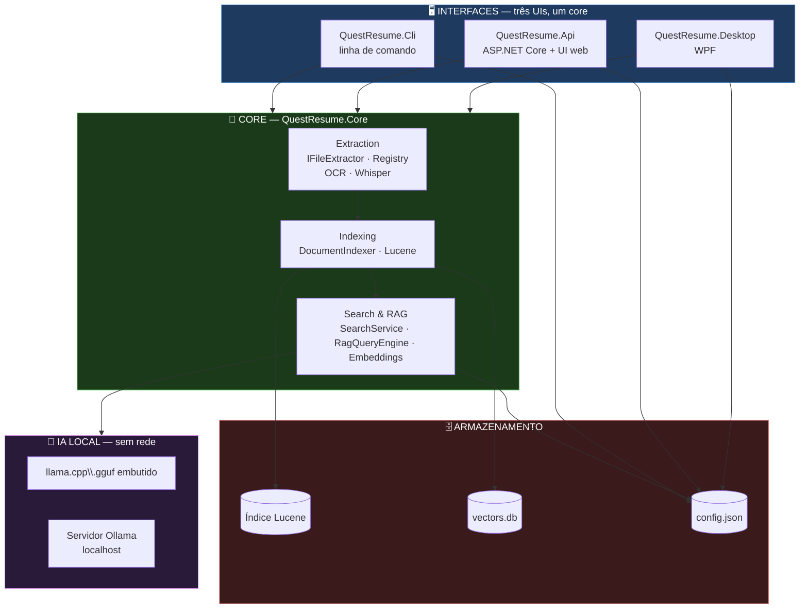
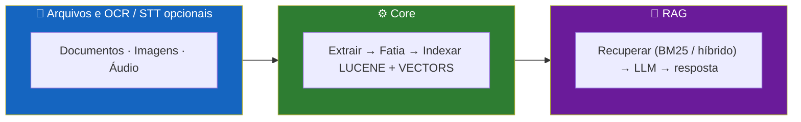
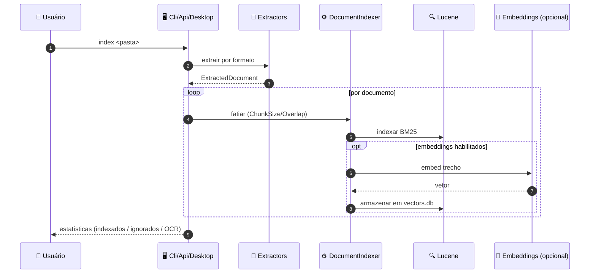
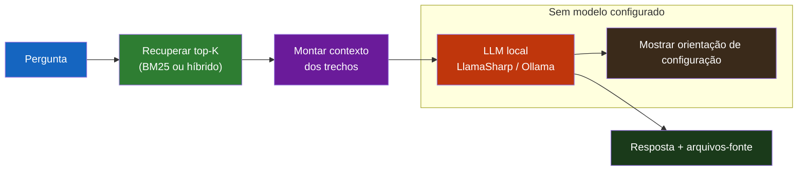

<div align="center">

**🌐 Choose Language / Selecione o Idioma / Elija el Idioma**

[](README.md)&nbsp;&nbsp;&nbsp;[](README_PT.md)&nbsp;&nbsp;&nbsp;[](README_ES.md)

</div>

---

<div align="center">

```
 ██████╗ ██╗   ██╗███████╗███████╗████████╗██████╗ ███████╗███████╗██╗   ██╗███╗   ███╗███████╗
██╔═══██╗██║   ██║██╔════╝██╔════╝╚══██╔══╝██╔══██╗██╔════╝██╔════╝██║   ██║████╗ ████║██╔════╝
██║   ██║██║   ██║█████╗  ███████╗   ██║   ██████╔╝█████╗  ███████╗██║   ██║██╔████╔██║█████╗
██║▄▄ ██║██║   ██║██╔══╝  ╚════██║   ██║   ██╔══██╗██╔══╝  ╚════██║██║   ██║██║╚██╔╝██║██╔══╝
╚██████╔╝╚██████╔╝███████╗███████║   ██║   ██║  ██║███████╗███████║╚██████╔╝██║ ╚═╝ ██║███████╗
 ╚══▀▀═╝  ╚═════╝ ╚══════╝╚══════╝   ╚═╝   ╚═╝  ╚═╝╚══════╝╚══════╝  ╚═════╝ ╚═╝     ╚═╝╚══════╝
          RAG Local 100% Offline — indexe seus arquivos, pergunte em linguagem natural
```

---

[](https://dotnet.microsoft.com/)
[](https://lucenenet.apache.org/)
[](https://github.com/SciSharp/LLamaSharp)
[](https://learn.microsoft.com/dotnet/desktop/wpf/)
[](https://dotnet.microsoft.com/apps/aspnet)

<br/>

> **Um sistema 100% offline para indexar seus arquivos locais e responder perguntas em**
> **linguagem natural sobre eles, usando busca full-text (Lucene.NET), opcionalmente**
> **busca vetorial híbrida, e um modelo de IA local (LLamaSharp/llama.cpp embutido ou Ollama).**

<br/>

-310-512BD4?style=flat-square)


</div>

---

## 📑 Índice

<details>
<summary>▶️ <strong>Clique para expandir / contrair esta seção</strong></summary>

<table>
<tr>
<td valign="top" width="50%">

**🏗️ Sistema**
- [Visão Geral](#-vis%C3%A3o-geral)
- [Arquitetura do Sistema](#-arquitetura-do-sistema)
- [Stack Tecnológica](#-stack-tecnol%C3%B3gica)
- [Padrões de Projeto](#-padr%C3%B5es-de-projeto-aplicados)
- [Estrutura do Projeto](#-estrutura-do-projeto)

**📦 Módulos**
- [Core — Extração e Indexação](#-core--extra%C3%A7%C3%A3o-e-indexa%C3%A7%C3%A3o)
- [Core — Busca e RAG](#-core--busca-e-rag)
- [Cli](#-cli)
- [Api](#-api)
- [Desktop](#-desktop)

</td>
<td valign="top" width="50%">

**💼 Negócio**
- [Regras de Negócio](#-regras-de-neg%C3%B3cio)
- [Requisitos Funcionais](#-requisitos-funcionais)
- [Requisitos Não Funcionais](#-requisitos-n%C3%A3o-funcionais)

**📐 Design**
- [Modelo de Dados](#-modelo-de-dados)
- [Fluxos do Sistema](#-fluxos-do-sistema)
- [Fluxo de Indexação](#fluxo-de-indexa%C3%A7%C3%A3o)
- [Fluxo de Pergunta RAG](#fluxo-de-pergunta-rag)

**🔐 Segurança e Operações**
- [Segurança](#-seguran%C3%A7a)
- [Instalação & Execução](#-instala%C3%A7%C3%A3o--execu%C3%A7%C3%A3o)
- [Testes Automatizados](#-testes-automatizados)
- [Métricas & Monitoramento](#-m%C3%A9tricas--monitoramento)
- [Limitações Conhecidas](#-limita%C3%A7%C3%B5es-conhecidas)

</td>
</tr>
</table>

---

</details>

## 🌟 Visão Geral

<details>
<summary>▶️ <strong>Clique para expandir / contrair esta seção</strong></summary>

**QuestResume** é um sistema **100% offline** para indexar o conteúdo de arquivos locais e responder perguntas em linguagem natural sobre eles, usando busca full-text (Lucene.NET), opcionalmente combinada com busca vetorial (embeddings), e um modelo de IA local para gerar as respostas (LLamaSharp/llama.cpp embutido, ou Ollama como alternativa).

Nenhuma chamada de rede é feita em tempo de execução (mesmo com Ollama, que roda localmente), não há custo por token/requisição, e seus arquivos nunca saem da máquina.

Recursos opcionais (todos desabilitados por padrão, com degradação graciosa — o sistema funciona normalmente sem eles):

- **OCR** (Tesseract 5): extrai texto de imagens e de PDFs digitalizados (sem texto selecionável).
- **Transcrição de áudio** (Whisper.net): extrai texto de arquivos `.wav` (16 kHz mono).
- **Embeddings + busca híbrida**: combina busca por palavras-chave (BM25) com busca por similaridade semântica (vetores), melhorando a recuperação de contexto para o RAG.
- **Ollama**: usa um servidor [Ollama](https://ollama.com) local como alternativa ao modelo `.gguf` embutido.

### 🎯 Objetivos do Sistema

| Objetivo | Descrição |
|-----------|-------------|
| 🔒 **Privacidade por design** | Arquivos nunca saem da máquina; nenhuma chamada de rede em tempo de execução |
| 💸 **Sem custo por token** | Roda inteiramente com modelos locais gratuitos; nada é cobrado por requisição |
| 🔍 **Busca full-text** | Busca por palavras-chave BM25 via Lucene.NET sobre documentos indexados |
| 🧠 **Busca semântica (opcional)** | Embeddings ONNX + recuperação híbrida BM25/vetorial para melhor contexto |
| 💬 **Respostas com LLM local** | `llama.cpp` embutido (.gguf) ou servidor Ollama local para respostas RAG |
| 📄 **Ampla cobertura de formatos** | 26+ formatos de texto nativos, mais OCR de imagens opcional e transcrição de áudio |

---

</details>

## 🏗️ Arquitetura do Sistema

<details>
<summary>▶️ <strong>Clique para expandir / contrair esta seção</strong></summary>

### Diagrama de Módulos



### Fluxo em Camadas



---

</details>

## 🛠️ Stack Tecnológica

<details>
<summary>▶️ <strong>Clique para expandir / contrair esta seção</strong></summary>

<table>
<thead>
<tr>
<th>Camada</th>
<th>Tecnologia</th>
<th>Versão</th>
<th>Propósito</th>
</tr>
</thead>
<tbody>
<tr>
<td><strong>🧠 Runtime</strong></td>
<td>.NET</td>
<td>8</td>
<td>Framework de destino; Desktop exige Windows (WPF)</td>
</tr>
<tr>
<td><strong>🔍 Busca full-text</strong></td>
<td>Lucene.NET</td>
<td>—</td>
<td>Indexação e recuperação por palavras-chave BM25</td>
</tr>
<tr>
<td><strong>🧠 LLM local</strong></td>
<td>LLamaSharp (llama.cpp)</td>
<td>—</td>
<td>Geração com modelo `.gguf` embutido para RAG</td>
</tr>
<tr>
<td><strong>🦙 Alternativa LLM</strong></td>
<td>Ollama</td>
<td>—</td>
<td>Servidor local como provedor alternativo</td>
</tr>
<tr>
<td><strong>👁️ OCR</strong></td>
<td>Tesseract 5</td>
<td>5</td>
<td>Texto de imagens e PDFs digitalizados (opcional)</td>
</tr>
<tr>
<td><strong>🎙️ Transcrição</strong></td>
<td>Whisper.net</td>
<td>—</td>
<td>Transcreve áudio `.wav` (opcional, ffmpeg para resample)</td>
</tr>
<tr>
<td><strong>🧲 Embeddings</strong></td>
<td>ONNX Runtime + tokenizer BERT</td>
<td>—</td>
<td>Vetores semânticos para busca híbrida (opcional)</td>
</tr>
<tr>
<td><strong>🖥️ Desktop</strong></td>
<td>WPF</td>
<td>net8.0-windows</td>
<td>Aplicativo desktop</td>
</tr>
<tr>
<td><strong>⚙️ API</strong></td>
<td>ASP.NET Core</td>
<td>8</td>
<td>API local + UI web estática</td>
</tr>
<tr>
<td><strong>🧪 Testes</strong></td>
<td>xUnit + integração opcional</td>
<td>—</td>
<td>Testes unitários do core mais integração controlada por env</td>
</tr>
</tbody>
</table>

---

</details>

## 📐 Padrões de Projeto Aplicados

<details>
<summary>▶️ <strong>Clique para expandir / contrair esta seção</strong></summary>

| Padrão | Onde | Justificativa |
|---------|-------|-----------|
| 🔌 **Estratégia por extrator** | `IFileExtractor` + `ExtractorRegistry` | Novos formatos são plugados sem tocar em indexação, busca ou RAG |
| 🏭 **Registry / factory** | `ExtractorRegistry.DefaultExtractors()` | Registro central de todos os formatos suportados |
| 🧩 **Carregamento de plugins** | `IExtractorPlugin` + `PluginLoader` | Carrega plugins de extração dinamicamente |
| 🛡️ **Degradação graciosa** | OCR/STT/embeddings desabilitados por padrão | Recursos opcionais ausentes degradam com elegância, nunca falham |
| 📐 **Comportamento dirigido por configuração** | `config.json` único compartilhado por todas as UIs | `TopK`, `ChunkSize`, provedores, pesos configuráveis sem mudar código |
| 🎯 **Separação recuperação–geração do RAG** | `SearchService`/`RagQueryEngine` | A recuperação (BM25/híbrida) é desacoplada da geração do LLM |
| 📦 **Core compartilhado entre UIs** | `QuestResume.Core` referenciado por Cli/Api/Desktop | Um pipeline de extração/indexação/busca reutilizado por todas as interfaces |
| 🌊 **Indexação em trechos** | `ChunkSize` + `ChunkOverlap` | Documentos divididos em trechos sobrepostos para recuperação granular |

---

</details>

## 📁 Estrutura do Projeto

<details>
<summary>▶️ <strong>Clique para expandir / contrair esta seção</strong></summary>

```
QuestResume/
│
├── 📄 QuestResume.slnx             # Arquivo de solução
├── 📄 Dockerfile                    # Empacotamento da API em container
├── 📄 README.md                     # 🇺🇸 English (principal)
├── 📄 README_PT.md                  # 🇧🇷 Português
├── 📄 README_ES.md                  # 🇪🇸 Español
│
├── 📂 src/
│   ├── 📂 QuestResume.Core/         # Biblioteca compartilhada: extração, indexação, busca, RAG
│   │   ├── Extraction/             # IFileExtractor · ExtractorRegistry · PluginLoader
│   │   │   └── EncodingDetector · LanguageDetector
│   │   ├── Indexing/              # DocumentIndexer
│   │   ├── Search/                # SearchService · RagQueryEngine
│   │   └── Embeddings/            # EmbeddingService (ONNX + tokenizer BERT)
│   ├── 📂 QuestResume.Cli/          # Interface de linha de comando
│   ├── 📂 QuestResume.Api/          # API local ASP.NET Core + UI web estática
│   ├── 📂 QuestResume.Desktop/      # Aplicativo desktop WPF
│   └── 📂 QuestResume.Mobile/        # Aplicativo complementar mobile
│
├── 📂 tests/
│   ├── 📂 QuestResume.Core.Tests/             # Testes unitários + integração opcional
│   └── 📂 QuestResume.Api.IntegrationTests/   # Testes de integração da API
│
└── 📂 models/
    └── 📂 llm/                      # (.gitignored) modelos .gguf para baixar
```

---

</details>

## 📦 Módulos do Sistema

<details>
<summary>▶️ <strong>Clique para expandir / contrair esta seção</strong></summary>

### 🧬 Core — Extração e Indexação

`QuestResume.Core/Extraction` define `IFileExtractor` além de um `ExtractorRegistry` com 26+ formatos diretos de texto: documentos (PDF incl. PDF/A, DOCX, ODT, RTF), planilhas/apresentações (XLSX, PPTX), texto/dados (TXT, CSV, JSON, XML, HTML/HTM, CSS, JS, BIB, TEX, ICS, VCF), notebooks (IPYNB), e-books (EPUB) e e-mails (EML, MSG). Extensões não suportadas (vídeo, executáveis) são contadas como "ignoradas" em vez de derrubar a indexação.

Com os recursos opcionais habilitados: imagens (`.png`, `.jpg`, `.jpeg`, `.tiff`, `.bmp`, `.gif`) via OCR do Tesseract; PDFs digitalizados (páginas sem texto extraível são rasterizadas e passadas pelo OCR automaticamente); áudio (`.wav`, 16 kHz mono) via transcrição do Whisper.net.

### 🔍 Core — Busca e RAG

`SearchService` realiza a recuperação por palavras-chave BM25 (ou híbrida BM25 + vetorial via `EmbeddingService`); `RagQueryEngine` recupera os K trechos principais e os envia ao LLM local (LLamaSharp `.gguf` ou Ollama) para compor uma resposta em linguagem natural com arquivos-fonte exibidos.

### 💻 Cli

`QuestResume.Cli` é a interface de linha de comando: `index`, `search`, `ask`, `chat` e comandos `config` (set-model, set-folder, provedores, OCR, embeddings, STT).

### 🌐 Api

`QuestResume.Api` é um servidor local ASP.NET Core com UI web estática e endpoints REST (`/api/status`, `/api/config`, `/api/index`, `/api/search`, `/api/ask`).

### 🖥️ Desktop

`QuestResume.Desktop` é um aplicativo WPF com uma aba **Perguntas** (escolher pasta, indexar, conversar mostrando arquivos-fonte) e uma aba **Configurações** para modelo, pasta do índice, Top-K, tamanho do contexto e configuração dos recursos opcionais.

---

</details>

## 📋 Regras de Negócio

<details>
<summary>▶️ <strong>Clique para expandir / contrair esta seção</strong></summary>

| # | Regra | Aplicação |
|---|------|-------------|
| BR-01 | Nenhuma chamada de rede em tempo de execução; arquivos nunca saem da máquina | Provedores de LLM/embeddings somente locais |
| BR-02 | Recursos opcionais desabilitados por padrão e com degradação graciosa | `OcrEnabled`/`SttEnabled`/`EmbeddingsEnabled` por padrão `false`; recursos ausentes mostram orientação, não erros |
| BR-03 | Extensões de arquivo não suportadas são contadas como "ignoradas", não como falhas | Estatísticas do indexador rastreiam arquivos ignorados |
| BR-04 | OCR exige `TessDataPath` configurado e habilitação | Sem isso, imagens/PDFs digitalizados são pulados |
| BR-05 | Whisper espera PCM 16 kHz mono; outras taxas são convertidas automaticamente via ffmpeg ou puladas com orientação | Lógica do extrator de áudio |
| BR-06 | A busca híbrida pondera BM25 vs vetores via `HybridBm25Weight` | 0 = só vetorial, 1 = só BM25, padrão 0,5 |
| BR-07 | As três UIs compartilham o mesmo arquivo de configuração e índice | Local único `%LOCALAPPDATA%\QuestResume` |
| BR-08 | Perguntar sem `.gguf`/Ollama válido mostra orientação de configuração, nunca erro genérico | Mensagens graciosas do motor RAG |

---

</details>

## ✨ Requisitos Funcionais

<details>
<summary>▶️ <strong>Clique para expandir / contrair esta seção</strong></summary>

| ID | Requisito | Prioridade | Status |
|----|-------------|----------|--------|
| **RF-01** | Indexar uma pasta de documentos com 26+ formatos de texto | 🔴 Alta | ✅ Implementado |
| **RF-02** | Busca por palavras-chave com Lucene.NET BM25 (sem modelo) | 🔴 Alta | ✅ Implementado |
| **RF-03** | Perguntas em linguagem natural com RAG usando LLM local | 🔴 Alta | ✅ Implementado |
| **RF-04** | Modo chat interativo (`chat`) | 🟡 Média | ✅ Implementado |
| **RF-05** | OCR opcional para imagens e PDFs digitalizados | 🟡 Média | ✅ Implementado |
| **RF-06** | Transcrição Whisper opcional para áudio `.wav` | 🟡 Média | ✅ Implementado |
| **RF-07** | Embeddings opcionais + busca híbrida BM25/vetorial | 🟡 Média | ✅ Implementado |
| **RF-08** | Ollama opcional como provedor de LLM | 🟡 Média | ✅ Implementado |
| **RF-09** | UI web via API local | 🟢 Baixa | ✅ Implementado |
| **RF-10** | Aplicativo desktop WPF com UI de configuração | 🟢 Baixa | ✅ Implementado |
| **RF-11** | Degradação graciosa de todos os recursos opcionais | 🔴 Alta | ✅ Implementado |
| **RF-12** | Mostrar arquivos-fonte de cada resposta | 🟢 Baixa | ✅ Implementado |
| **RF-13** | Empacotamento Docker da API | 🟢 Baixa | ✅ Implementado |
| **RF-14** | Comandos `config` de `set`/`show` em todas as configurações | 🟡 Média | ✅ Implementado |

---

</details>

## ⚙️ Requisitos Não Funcionais

<details>
<summary>▶️ <strong>Clique para expandir / contrair esta seção</strong></summary>

| ID | Categoria | Requisito | Alvo |
|----|----------|-------------|--------|
| **RNF-01** | 🔐 Privacidade | Zero chamadas de rede em tempo de execução | LLM/embeddings/OCR/STT somente locais |
| **RNF-02** | 💸 Custo | Sem custo por token/requisição | Modelos locais gratuitos |
| **RNF-03** | 🛡️ Resilência | Recursos opcionais ausentes nunca falham | Caminhos de degradação graciosa |
| **RNF-04** | 🧩 Extensibilidade | Novos formatos adicionados sem mudar o core | `IFileExtractor` + registry |
| **RNF-05** | 📦 Compatibilidade | Roda em máquinas com 8 GB de RAM | Modelos Q4_K_M ~2 GB |
| **RNF-06** | 🔀 Portabilidade | CLI/API em qualquer SO .NET 8; Desktop só Windows | WPF `net8.0-windows` |
| **RNF-07** | 🔍 Qualidade de recuperação | Lembrança de contexto para perguntas parafraseadas | Recuperação híbrida BM25 + vetorial |
| **RNF-08** | 🧪 Testabilidade | Recursos opcionais testáveis sem modelos reais | Testes de integração controlados por env |
| **RNF-09** | 🗄️ Compartilhamento de estado | Um índice/config utilizável de qualquer UI | Local compartilhado `%LOCALAPPDATA%` |

---

</details>

## 🗄️ Modelo de Dados

<details>
<summary>▶️ <strong>Clique para expandir / contrair esta seção</strong></summary>

### Configuração (`config.json`)

| Campo | Descrição | Padrão |
|-------|-------------|---------|
| `DocumentsFolder` | Última pasta indexada | (vazio) |
| `IndexPath` | Pasta do índice Lucene + vector store | `%LOCALAPPDATA%\QuestResume\index` |
| `ModelPath` | Caminho do modelo `.gguf` (quando `LlmProvider=LlamaSharp`) | (vazio) |
| `TopK` | Trechos recuperados por pergunta | 5 |
| `ChunkSize` | Tamanho do trecho em caracteres | 1000 |
| `ChunkOverlap` | Sobreposição entre trechos | 150 |
| `ContextSize` | Tamanho do contexto do LLM (tokens) | 4096 |
| `LlmProvider` | Provedor de geração: `LlamaSharp` ou `Ollama` | `LlamaSharp` |
| `OllamaBaseUrl` | URL do servidor Ollama local | `http://localhost:11434` |
| `OllamaModel` | Nome do modelo Ollama | `llama3.2` |
| `OcrEnabled` / `TessDataPath` / `OcrLanguages` | Ativação do OCR, caminho tessdata, idiomas | `false` / (vazio) / `por+eng` |
| `EmbeddingsEnabled` / `EmbeddingModelPath` / `EmbeddingTokenizerPath` / `HybridBm25Weight` | Ativação da busca híbrida, modelo ONNX, tokenizer, peso BM25 | `false` / (vazio) / (vazio) / `0.5` |
| `SttEnabled` / `WhisperModelPath` | Transcrição de áudio, modelo ggml | `false` / (vazio) |

### Armazenamentos

| Armazenamento | Propósito |
|-------|---------|
| Índice Lucene | Índice full-text BM25 em `IndexPath` |
| `vectors.db` | Embeddings semânticos por trecho (quando habilitado) |
| `config.json` | Configuração compartilhada lida/escrita por todas as UIs |
| Metadados SQLite | Metadados de documentos extraídos |

---

</details>

## 🔄 Fluxos do Sistema

<details>
<summary>▶️ <strong>Clique para expandir / contrair esta seção</strong></summary>

### Fluxo de Indexação



### Fluxo de Pergunta RAG



---

</details>

## 🔐 Segurança

<details>
<summary>▶️ <strong>Clique para expandir / contrair esta seção</strong></summary>

### Controles Implementados

| Controle | Implementação |
|---------|---------------|
| 🔒 **Processamento somente local** | Nenhuma chamada de rede em tempo de execução; arquivos nunca saem da máquina |
| 🔑 **Privacidade do modelo local** | LLM e embeddings rodam totalmente no dispositivo |
| 🧾 **Falha graciosa** | Recursos opcionais ausentes mostram orientação em vez de expor erros |
| 🗄️ **Armazenamento local** | Índice, vetores e configuração ficam sob `%LOCALAPPDATA%` |

### Limitações de Segurança Conhecidas

| Limitação | Risco | Caminho de mitigação |
|------------|------|-----------------|
| 🔓 **Sem cifragem em repouso** | Índice/configuração armazenados em texto puro no disco | Adicionar cifragem protegida pelo SO para corpora sensíveis |
| 🌐 **Exposição do Ollama no localhost** | O servidor Ollama pode ser alcançável na rede local | Vincular o Ollama apenas a `localhost` |
| 🧰 **Dependência de ffmpeg** | A conversão de áudio delega a um binário externo no PATH | ffmpeg documentado/instalado no sistema |

---

</details>

## 🚀 Instalação & Execução

<details>
<summary>▶️ <strong>Clique para expandir / contrair esta seção</strong></summary>

### Pré-requisitos

- [.NET 8 SDK](https://dotnet.microsoft.com/download/dotnet/8.0)
- Windows (o app Desktop usa WPF; CLI e API funcionam em qualquer SO .NET 8)
- Opcional, mas necessário para perguntas com IA: um modelo `.gguf`

### Compilando

```powershell
dotnet build QuestResume.sln
```

### CLI

```powershell
# Indexar uma pasta de documentos
dotnet run --project src/QuestResume.Cli -- index "C:\Users\voce\Documentos"

# Busca por palavras-chave (sem modelo de IA)
dotnet run --project src/QuestResume.Cli -- search "contrato de aluguel"

# Perguntar em linguagem natural (precisa de modelo .gguf configurado)
dotnet run --project src/QuestResume.Cli -- ask "Qual o valor do aluguel mencionado nos documentos?"

# Chat interativo
dotnet run --project src/QuestResume.Cli -- chat

# Configurações
dotnet run --project src/QuestResume.Cli -- config show
dotnet run --project src/QuestResume.Cli -- config set-model "C:\Modelos\Phi-3-mini-4k-instruct-q4.gguf"
```

### API + Web

```powershell
dotnet run --project src/QuestResume.Api
```

Abra o endereço exibido (ex.: `http://localhost:5000`) no navegador: indexar uma pasta, buscar, perguntar e configurar o modelo de IA, OCR, STT e embeddings/busca híbrida na aba Configurações.

### Desktop

```powershell
dotnet run --project src/QuestResume.Desktop
```

### Publicação

```powershell
# Executável Windows autocontido do Desktop
dotnet publish src/QuestResume.Desktop -c Release -p:PublishProfile=win-x64

# Container da API
docker build -t questresume-api .
docker run -p 8080:8080 -v questresume-data:/root/.local/share/QuestResume questresume-api
```

---

</details>

## 🧪 Testes Automatizados

<details>
<summary>▶️ <strong>Clique para expandir / contrair esta seção</strong></summary>

### Testes Unitários

Cobrem o caminho de "recurso não configurado" (degradação graciosa) para OCR, transcrição e embeddings sem precisar de modelos reais, além da lógica principal de indexação/busca.

```powershell
dotnet test tests/QuestResume.Core.Tests
```

### Testes de Integração Opcionais

Só rodam quando variáveis de ambiente apontam para arquivos/pastas existentes (caso contrário, passam sem fazer nada):

| Variável | Testa |
|----------|-------|
| `QUESTRESUME_TEST_TESSDATA_PATH` (+ `QUESTRESUME_TEST_OCR_LANGUAGES`) | OCR com uma imagem gerada na hora |
| `QUESTRESUME_TEST_WHISPER_MODEL` | Transcrição com um `.wav` de teste |
| `QUESTRESUME_TEST_EMBEDDING_MODEL` + `QUESTRESUME_TEST_EMBEDDING_TOKENIZER` | Embeddings semânticos |

### CI

`.github/workflows/ci.yml` compila a solução completa e roda os testes em `windows-latest` (necessário porque o Desktop usa WPF/`net8.0-windows`) a cada push/PR para `main`.

---

</details>

## 📊 Métricas & Monitoramento

<details>
<summary>▶️ <strong>Clique para expandir / contrair esta seção</strong></summary>

### Métricas do Código

| Métrica | Valor |
|--------|-------|
| Projetos da solução | 7 (Core, Cli, Api, Desktop, Mobile + 2 projetos de teste) |
| Arquivos C# (src) | 310 |
| Arquivos C# (testes) | 97 |
| Formatos diretos de texto | 26+ |
| Motores opcionais | 3 (OCR, STT, embeddings) |
| UIs compartilhando um core | 3 (CLI, API+Web, Desktop) |

### Sinais em Tempo de Execução

| Sinal | Fonte | Onde observar |
|--------|--------|--------------------|
| Estado do índice | `/api/status` | API / CLI `config show` |
| Estado dos recursos opcionais | Bandeiras OCR/embeddings/STT | `/api/status` |
| Contagens indexados / ignorados | Estatísticas do indexador | Após cada execução de `index` |
| Saúde do provedor | LlamaSharp vs Ollama | Mensagens do fluxo de perguntas |

### Endpoints da API

| Método | Rota | Descrição |
|--------|-------|-------------|
| `GET` | `/api/status` | Estado do índice, do provedor e dos recursos opcionais |
| `GET`/`PUT` | `/api/config` | Ler / atualizar configuração |
| `POST` | `/api/index` | Indexar uma pasta |
| `POST` | `/api/search` | Busca BM25 ou híbrida |
| `POST` | `/api/ask` | Pergunta RAG |

---

</details>

## ⚠️ Limitações Conhecidas

<details>
<summary>▶️ <strong>Clique para expandir / contrair esta seção</strong></summary>

| Categoria | Problema | Estado |
|----------|-------|--------|
| 🖼️ **Idiomas do OCR** | Exige arquivos `tessdata` do Tesseract baixados (`por+eng` padrão) | ➕ Intencional — dependência opcional |
| 🎙️ **Formato de áudio** | Whisper.net não faz resample; `.wav` deve ser PCM 16 kHz mono, ou convertido via ffmpeg | ⚠️ Aberto — documentar/instalar ffmpeg |
| 🧲 **Restrição do modelo de embeddings** | Exige tokenizer WordPiece/BERT (`vocab.txt`); modelos XLM-RoBERTa/SentencePiece são incompatíveis | ➕ Intencional — documentado |
| 🧠 **Tamanho do LLM em máquinas com pouca RAM** | Modelos maiores (Mistral-7B ~4.4 GB) exigem 16 GB+ de RAM | ➕ Recomendar modelos menores Q4_K_M |
| 🔓 **Sem cifragem em repouso** | Índice e configuração armazenados em texto puro | ⬜ Planejado — cifragem protegida pelo SO |
| 🌐 **Exposição do Ollama** | Ollama pode ser alcançável na rede local se vinculado amplamente | ⬜ Planejado — vincular a localhost |

> [!TIP]
> Próximo passo: um extrator de metadados (`MetadataExtractor`/ExifTool) preenchendo apenas `ExtractedDocument.Metadata` (autor, datas, dimensões, codec) com `Text` vazio — útil para busca por metadados. Adicione um novo formato implementando `IFileExtractor` e registrando-o em `ExtractorRegistry.DefaultExtractors()`; `DocumentIndexer`, `SearchService` e `RagQueryEngine` não precisam de nenhuma alteração.

</details>

---

<div align="center">

---

### 🔍 QuestResume

*RAG 100% offline — seus arquivos nunca saem da máquina.*

[](https://dotnet.microsoft.com/)
[]()
[]()
[]()

<br/>

```
"Indexe o que você tem. Pergunte em linguagem simples. Nada sai da sua máquina."
```

</div>
